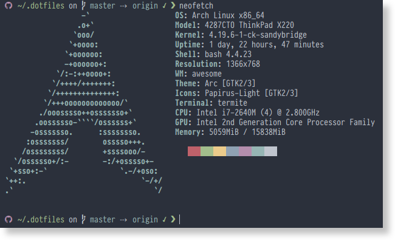

<p align="center" >
    
</p>

## About

This repository contains files for configuring my Terminal environment and other various macOS settings. See [Github does dotfiles](https://dotfiles.github.io) for more info

## What does it look like




## Is there a cool thing that I can use ?

While my dotfiles are optimised for my workflow, you can maybe find something interesting in it.

### Snippy

[`Snippy`](https://github.com/BarbUk/dotfiles/blob/master/bin/snippy) is enhanced version of the snippy snippet utility.
I use it everyday with more than 1600 snippets.

Here some enhancements that I made:
* restore current clipboard after pasting the snippet
* `{clipboard}` placeholder to use current clipboard in snippet
* `{cursor}` placeholder to place the cursor
* `##noparse` header in snippet to not parse

### Chrome history

[`Chrome history`](https://github.com/BarbUk/dotfiles/blob/master/bin/chrome_history) is a basic shell script that output your chrome browser history. It's made to work with [`rofi`](https://github.com/DaveDavenport/rofi).

You can use it in rofi to open a link
Exemple:
```
rofi -combi-modi "chrome:chrome_history,window,drun" -show combi -modi combi -lines 25  -display-combi '> '
```

### Change theme

I need a light theme to work during the day with the sun light, and a dark theme to geek at night. So I made a quick script to handle the switch: [`change_theme`](https://github.com/BarbUk/dotfiles/blob/master/bin/change_theme).

A perfect fit for the ThinkVantage button.

### Detect screen

[`Detect_screen`](https://github.com/BarbUk/dotfiles/blob/master/bin/detect_screen), a script to automate screen configuration when you plug a new screen.

### Give me hostname

When you need a list of your server to ssh to: [Give me hostname](https://github.com/BarbUk/dotfiles/blob/master/bin/give_me_hostname). Combine it with [`fzf`](https://github.com/junegunn/fzf) to [autocomplete](https://github.com/BarbUk/dotfiles/blob/master/shell/completion) the ssh/scp/rsync commands.

### Light bar

[Light bar](https://github.com/BarbUk/dotfiles/blob/master/bin/light_bar) is a minimal script to change screen brightness and display a simple bar. Good to include in awesomewm or any other wm.

### Ssh connect
[Ssh connect](https://github.com/BarbUk/dotfiles/blob/master/bin/ssh_connect) is a script that:
 * check if the server exists
 * autocomplete from my server list
 * sync my server dotfiles
 * connect to my tmux session or create a new one

## Installation

**Warning:** If you want to give these dotfiles a try, you should first fork this repository, review the code, and remove things you don’t want or need. Don’t blindly use my settings unless you know what that entails. Use at your own risk!

### Using Git

Clone the repository in `~/.dotfiles`:

```bash
git clone https://github.com/barbuk/dotfiles ~/.dotfiles && ~/.dotfiles
```
init the submodules:

```bash
git submodule update --init
```

You can use source bashrc or use install.sh to symlink the files.
