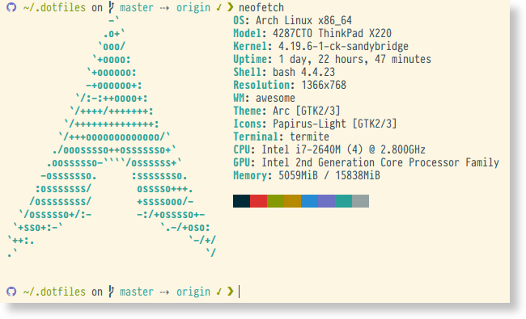

<p align="center" >
    
</p>

# Dotfiles

This repository contains my personal dotfiles for various tools and applications on my Linux system. These files are tailored to my workflow and preferences, but feel free to browse, be inspired, and adapt them to your own needs.

## Features

This dotfiles repository includes configurations for a variety of applications and a collection of custom scripts to enhance my command-line experience.

### Configuration For

* **Shell:** Bash (via Bash-it)
* **Terminal Emulators:** Alacritty, Kitty, Termite, Wezterm, Ghostty
* **Window Managers:** AwesomeWM, Hyprland
* **Editors:** Vim
* **Other Tools:** Git, Rofi, Tmux, and more.

### Key Scripts

Here are some of the most useful scripts included in this repository:

| Script                                                                 | Description                                                                                                                              |
| ---------------------------------------------------------------------- | ---------------------------------------------------------------------------------------------------------------------------------------- |
| [`Snippy`](https://github.com/BarbUk/snippy)                             | An enhanced version of the `snippy` snippet utility with features like clipboard integration, cursor placement, and script execution.        |
| [`mprisctl`](bin/mprisctl)                                               | A wrapper for `playerctl` to control media players with a simple interface.                                                              |
| [`chrome_history`](bin/chrome_history)                                   | A script to browse and open Chrome history using `rofi`.                                                                                 |
| [`change_theme`](bin/change_theme)                                       | Switches between light and dark themes for various applications.                                                                         |
| [`detect_screen`](bin/detect_screen)                                     | Automatically configures screen layouts when a new monitor is connected.                                                                 |
| [`give_me_hostname`](bin/give_me_hostname)                               | Lists servers for SSH connections, designed to work with `fzf` for autocompletion.                                                       |
| [`light_bar`](bin/light_bar)                                             | A minimal script to change screen brightness and display a notification bar.                                                             |
| [`vol_bar`](bin/vol_bar)                                                 | A minimal script to change volume and display a notification bar.                                                                        |
| [`ssh_connect`](bin/ssh_connect)                                         | A script to manage SSH connections, including server checks, autocompletion, dotfiles synchronization, and tmux session management.       |
| [`open_sftp`](bin/open_sftp)                                             | Opens a file manager to the remote server of the currently active terminal window.                                                       |
| [`pulseaudio_toggle_default_sink`](bin/pulseaudio_toggle_default_sink)     | A script to toggle the default audio output sink and move audio inputs between sinks, compatible with both PulseAudio and PipeWire.      |

## Screenshots

Here's a glimpse of what my terminal environment looks like:




## Installation

**Disclaimer:** These dotfiles are highly personalized. Before using them, I strongly recommend forking this repository, reviewing the code, and customizing it to your own preferences. Use at your own risk.

### 1. Clone the Repository

Clone this repository to a directory on your local machine. A common convention is to use a hidden directory like `~/.dotfiles`.

```bash
git clone https://github.com/your-username/dotfiles.git ~/.dotfiles
cd ~/.dotfiles
```

### 2. Initialize Submodules

This repository uses Git submodules to manage third-party tools and plugins. Initialize them with the following command:

```bash
git submodule update --init --recursive
```

### 3. Install Dependencies

The scripts and configurations in this repository depend on various packages and tools. You will need to install them using your system's package manager. Some of the key dependencies include:

* `fzf`
* `rofi`
* `playerctl`
* `xrandr` (for `detect_screen`)

Review the scripts and configuration files to identify all the necessary dependencies.

### 4. Symlink the Dotfiles

The `install.sh` script creates symbolic links from the files in this repository to their corresponding locations in your home directory.

```bash
./install.sh
```

Alternatively, you can manually symlink the files you want to use.

## Usage

After installation, your shell and applications should be configured according to the files in this repository. You may need to restart your terminal or window manager for the changes to take effect.

The custom scripts are located in the `bin/` directory. If you've added this directory to your `PATH`, you can run them directly from your terminal.

## Contributing

While these are my personal dotfiles, I'm open to suggestions and improvements. If you have any ideas, feel free to open an issue or submit a pull request.
